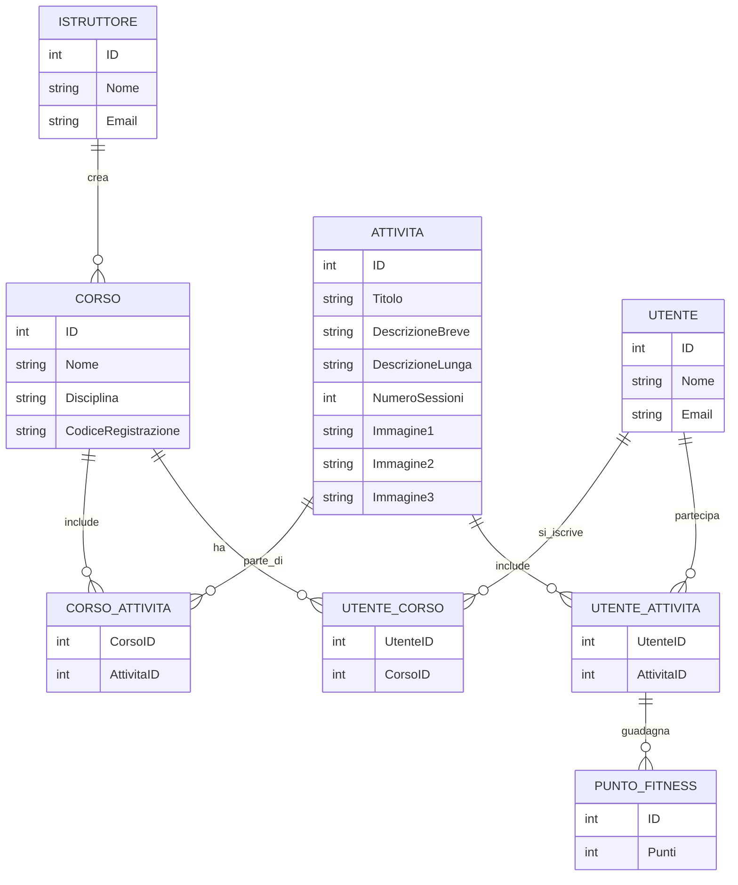

#SQL

```sql
INSERT INTO ISTRUTTORE (id, nome, email) VALUES
(1, 'Marco Rossi', 'marco.rossi@palestrafit.it'),
(2, 'Anna Bianchi', 'anna.bianchi@danzaenergia.com');

INSERT INTO CORSO (id, nome, codice_iscrizione, istruttore_id) VALUES
(1, 'Pilates per principianti', 'PILATES101', 1),
(2, 'Hip Hop dance', 'HIPHOP202', 2);

INSERT INTO ATTIVITA (id, titolo, descrizione_breve, descrizione_estesa, sessioni, corso_id) VALUES
(1, 'Riscaldamento dinamico', 'Esercizi di mobilità e attivazione muscolare', 'Una serie di esercizi per preparare il corpo al Pilates', 10, 1),
(2, 'Coreografia base', 'Impara i primi passi di una coreografia hip hop', 'Creazione di una sequenza di movimenti semplici e divertenti', 12, 2);

INSERT INTO UTENTE (id, nome, email) VALUES
(1, 'Sofia Verdi', 'sofia.verdi@gmail.com'),
(2, 'Luca Neri', 'luca.neri@outlook.it');

INSERT INTO IMMAGINE (id, url, attivita_id) VALUES
(1, 'pilates_riscaldamento.jpg', 1),
(2, 'hiphop_coreografia.png', 2);

INSERT INTO DISCIPLINA (id, nome) VALUES
(1, 'Pilates'),
(2, 'Danza');

INSERT INTO ISCRIZIONE (user_id, corso_id) VALUES  -- Utilizzato il nome rinominato
(1, 1),
(2, 2);

INSERT INTO PUNTO_FITNESS (id, punti, data_assegnazione, user_id, attivita_id) VALUES
(1, 8, '2023-02-10', 1, 1),
(2, 12, '2023-02-15', 2, 2);
```
